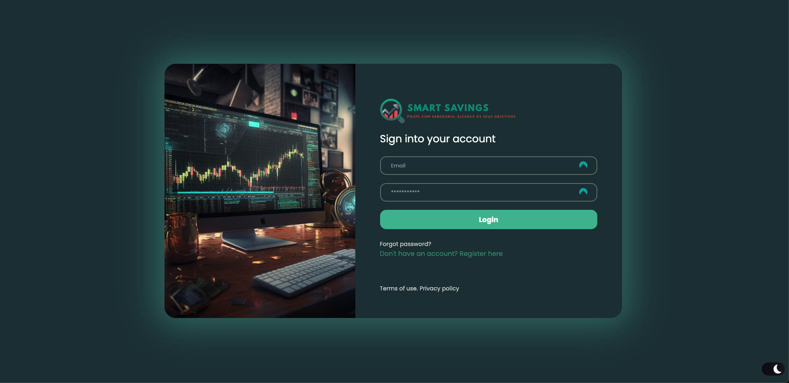
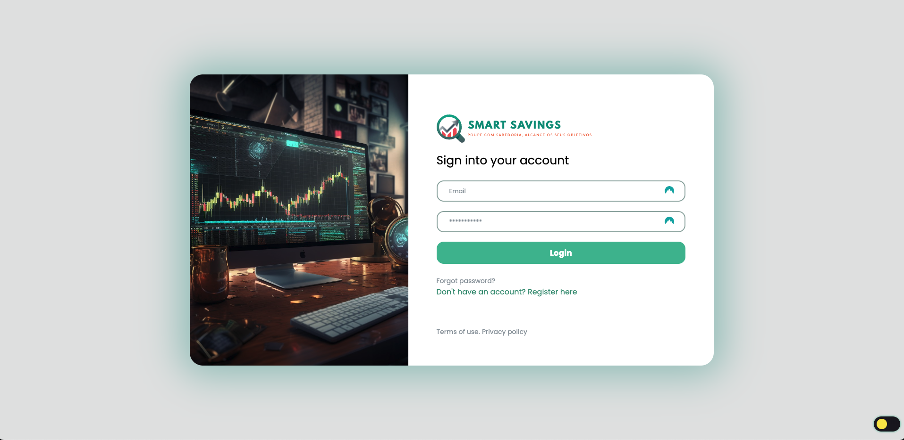

<link rel="stylesheet" href="https://fonts.googleapis.com/css2?family=League+Spartan:wght@700&display=swap" />
<h1 align="center">
   
  
</h1>

  <a href="#smart-savings">Smart Savings</a> •
  <a href="#credits">Credits</a> 

# Smart Savings

Smart Savings is an innovative platform that empowers investors to make more informed financial decisions. Utilizing advanced calculators, educational content, and a supportive community, Smart Savings equips investors with the tools necessary to achieve their financial goals.

## Unique Features

Smart Savings stands out for several reasons:

-   **Advanced Calculators:** Gain a clear view of the potential for financial growth over time.
-   **Educational Content:** Access valuable tips on personal finance and investing.

## Benefits for Investors

Smart Savings provides a range of benefits for investors, including:

-   Make more informed financial decisions.
-   Increase the chances of achieving financial goals.
-   Reduce the risk of financial losses.
-   Improve financial literacy.

## Target Audience

Smart Savings caters to investors of all levels, from beginners to experienced investors. The advanced calculators are suitable for those seeking precise and comprehensive tools for investment projection, while the educational content is designed for individuals looking to enhance their knowledge of personal finance and investing.

## Usage

Smart Savings can be employed in various ways:

-   Project investment growth.
-   Determine the amount needed to achieve a financial goal.
-   Compare different investment strategies.
-   Learn more about personal finance and investing.

## Credits

This App was been developed by:

-   [Sara Presa](https://github.com/sarapresa)
-   [Pedro Sousa](https://github.com/pedrols74)
-   [Dautarim Lopes](https://github.com/Dauta2002)
-   [Diogo Lemos](https://github.com/DiogoLemos9)
-   [João Almeida](https://github.com/joaoalmeiida40)
-   [Nagib Camará](https://github.com/nagib01)
