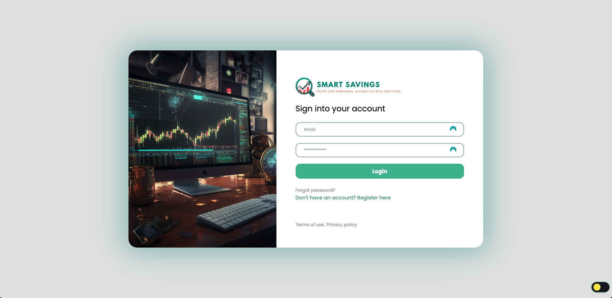

<link rel="stylesheet" href="https://fonts.googleapis.com/css2?family=League+Spartan:wght@700&display=swap" />
<h1 align="center">
   
  
</h1>

  <a href="#key-features">Key Features</a> •
  <a href="#creditos">Credits</a> 

## Key Features

-   Registo e Login de Utilizadores.
-   Light and Dark mode.
-   Calculadora de Juro Composto.

## Creditos

Esta Aplicação foi desenvolvida por:

-   [Sara Presa](https://github.com/sarapresa)
-   [Pedro Sousa](https://github.com/pedrols74)
-   [Dautarim Lopes](https://github.com/Dauta2002)
-   [Diogo Lemos](https://github.com/DiogoLemos9)
-   [João Almeida](https://github.com/joaoalmeiida40)
-   [Nagib Camará](https://github.com/nagib01)
